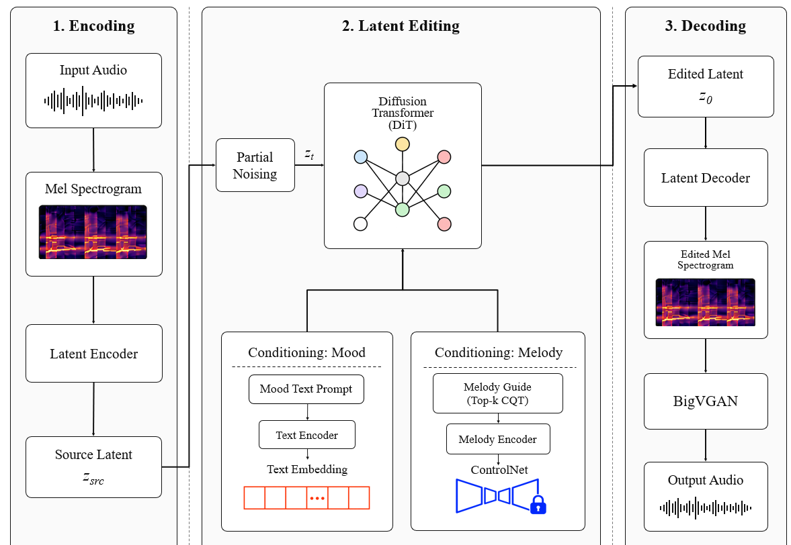

# Diffusion for Mood Transfer in Music using Top-K CQT

---

**Research Mentor:** Ray Chen
**Faculty Advisor:** Dr. Christian Grant
**Institution:** University of Florida, Department of Computer & Information Science & Engineering (CISE)
**Duration:** 10 months

---

## Research Focus

This project investigates the application of diffusion models to perform text-conditioned mood editing in music audio. The goal is to modify the emotional character of a musical piece — shifting its mood based on a text prompt — while preserving the original harmonic content and structural identity. Our approach uses a 21M-parameter diffusion transformer that operates on spectral representations of audio, achieving 0.80 chroma cosine similarity (indicating strong harmonic preservation) while shifting the log-mel spectrum by 5 dB to reflect the target mood.

A key component of the pipeline is a convolutional autoencoder designed in PyTorch that compresses 44.1 kHz spectrograms by 8x into a diffusion-ready latent space. We leverage the Constant-Q Transform (CQT), a time-frequency representation whose logarithmically spaced frequency bins align naturally with musical pitch perception, making it well suited for capturing harmonic and timbral features that convey mood. A Top-K selection mechanism over CQT coefficients focuses the model's attention on the most salient spectral components — those that carry the strongest mood signal — rather than processing the full, high-dimensional representation.

## Project Responsibilities

My responsibilities on this project span the full research pipeline. I built the text-conditioned music mood-editing pipeline, including the design and implementation of the diffusion transformer architecture. I designed the convolutional autoencoder in PyTorch that compresses raw spectrograms into a compact latent representation suitable for the diffusion process. This involved experimenting with network configurations, loss functions, and the Top-K CQT selection strategy to balance reconstruction quality with mood transfer effectiveness.

I am also responsible for building and curating the data pipeline — sourcing music audio, computing CQT and log-mel representations, and preparing training data. I conduct quantitative evaluations of the model's outputs using metrics such as chroma cosine similarity and spectral shift measurements. Beyond the technical work, I participate in weekly meetings with my mentor and faculty advisor, present progress updates, and contribute to the writing of research documentation.

---

## Media

---

[← Back to Portfolio](../README.md)
